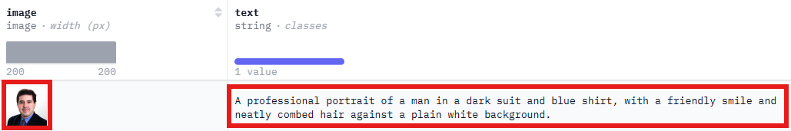
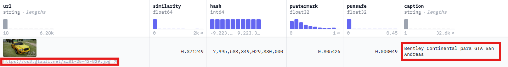
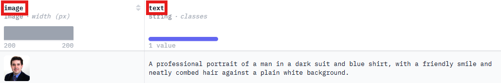
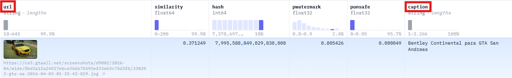

# ReGen

[](https://www.python.org/)

ReGen is a tool designed to automate white-box model-inversion attacks on any Hugging Face text-to-image model built with the 'Diffusers' library.
Although capable of targeting foundational pretrained models like Stable Diffusion or MidJourney (given sufficient storage and computational resources), ReGen is optimized for use with pre-trained models fine-tuned on smaller datasets.

## Table of Contents

- [Installation](#installation)
- [Usage](#usage)
- [Configuration](#configuration)
- [Examples](#examples)

## Installation

### Requirements

- Python 3.8 or higher

### Steps

1. Clone the repository:
   ```bash
   git clone https://github.com/CSE-5472-Team-8/ReGen.git
   cd project-name
   ```
2. Create and activate a virtual environment:
   ```bash
   python3 -m venv env
   source env/bin/activate  # Windows: env\Scripts\Activate.ps1
   ```
3. Install required dependencies:
   ```bash
   pip install -r requirements.txt
   ```

## Usage

### Requirements

- NVIDIA GPU
- CUDA ([Windows](https://docs.nvidia.com/cuda/cuda-installation-guide-microsoft-windows/), [Linux](https://docs.nvidia.com/cuda/cuda-installation-guide-linux/))
- [Hugging Face token](https://huggingface.co/docs/hub/en/security-tokens) with READ role

### Starting ReGen

Simply navigate to the 'pipeline' folder and run the main file:

```bash
cd pipeline
python main.py
```

The first time running the program, you will be prompted to input your Hugging Face API token

```

Welcome to

███████████              █████████
░░███░░░░░███            ███░░░░░███
 ░███    ░███   ██████  ███     ░░░   ██████  ████████
 ░██████████   ███░░███░███          ███░░███░░███░░███
 ░███░░░░░███ ░███████ ░███    █████░███████  ░███ ░███
 ░███    ░███ ░███░░░  ░░███  ░░███ ░███░░░   ░███ ░███
 █████   █████░░██████  ░░█████████ ░░██████  ████ █████
░░░░░   ░░░░░  ░░░░░░    ░░░░░░░░░   ░░░░░░  ░░░░ ░░░░░

This tool performs automated white-box Model Inversion Attacks (MIA) on any Hugging Face text-to-image model.
You will need the model ID, the dataset ID it was trained on, a Hugging Face API key with access to both, and
any additional information requested by the program.

Disclaimer: This tool is intended for educational purposes only. It was created to demonstrate the concept of
MIAs and should not be used for unauthorized or malicious activities.
================================================================================================================

Please enter your Hugging Face access token: xx_xxxxxxxxxxxxxxxxxxxxxxxxxxxxxxxxxx
```

If the Hugging Face authentication is successful you will see this message:

```
Hugging Face login successful!
```

Otherwise, you will be re-prompted to enter the Hugging Face token:

```
Hugging Face login failed.

Please enter your Hugging Face access token: xx_xxxxxxxxxxxxxxxxxxxxxxxxxxxxxxxxxx
```

### Selecting Model and Dataset

```
1) Manually choose a text-to-image model and dataset.
2) Select text-to-image model and dataset from list.
```

#### Manual

```

Enter your choice: 1

Enter the text-to-image model ID: landonbconnell/model_inversion_demo

Enter the dataset ID: landonbconnell/model_inversion_demo_dataset

You selected the model ID 'landonbconnell/model_inversion_demo' and dataset ID 'landonbconnell/model_inversion_demo_dataset'.
Is that correct? (Y/N): y
```

#### From a List

```
Enter your choice: 2

     Model                                             Dataset
=============================================================================================
1)    hahminlew/sdxl-kream-model-lora-2.0                hahminlew/kream-product-blip-captions
2)    sshh12/sdxl-lora-pokemon                           lambdalabs/pokemon-blip-captions
3)    sshh12/sdxl-lora-planet-textures                   sshh12/planet-textures
...
58)   andrefz/sd-pokemon-model-lora-sdxl                 lambdalabs/pokemon-blip-captions
59)   swj0419/sdxl-pokemon-model                         lambdalabs/pokemon-blip-captions
60)   VikramSingh178/sdxl-lora-finetune-product-caption  hahminlew/kream-product-blip-captions

Enter your choice: 43

You selected the model ID 'rjaiswal/sdxl-montresandco-model-lora' and dataset ID 'rjaiswal/montresandco-dataset'.
Is that correct? (Y/N): y
```

### Selecting Image/Image URL and Caption Feature Names

The program will ask you if the dataset you're testing with contains images and captions, or image urls and captions. Some datasets have the images stored directly on Hugging Face, while others only have the URLs of where to find the images.

```
The dataset contains:
1) Images and captions
2) Image URLs and captions
```

This is an example of option 1:


And this is an example of option 2:


Next, it will ask you what the names are for the image/image URL and caption features.

For example, the image and caption feature names for this one are 'image' and 'text':


While the image _URL_ and caption feature names for this one are 'url' and 'caption':


In most cases, the program will be able to automatically detect the names of the features, but will ask you to confirm:

```
You selected 'Images and captions'. Is this correct? (Y/N): y

Detected image feature as 'image' and caption feature as 'text'. Is this correct? (Y/N): y
```

If the detected feature names are incorrect, or it can't detect them at all, it will ask you to enter them manually:

```
Failed to find dataset features. They need to be entered manually.
Enter the name of the image_url feature: url
Enter the name of the caption feature: caption

Detected image URL feature as 'url' and caption feature as 'caption'. Is this correct? (Y/N): y
```

You won't be asked for input again until the CLIP embeddings have finished generating and the training images have been clustered. It will then ask you how many clusters you wish to attack:

```
Enter the number of clusters to attack (0 - 1): 1

You selected 1 clusters to display. Is that correct? (Y/N): y

Cluster ID: 0
A professional portrait of a man in a dark suit and blue shirt, with a friendly smile and neatly combed hair against a plain white background.
A professional portrait of a man in a dark suit and blue shirt, with a friendly smile and neatly combed hair against a plain white background.
A professional portrait of a man in a dark suit and blue shirt, with a friendly smile and neatly combed hair against a plain white background.
...
```

## Configuration

### Default Settings

pipeline/config/settings.json:

```json
{
  "clip_embeddings": {
    "batch_size": 5000
  },
  "find_clusters": {
    "epsilon": 0.5,
    "clustering_metric": "euclidean",
    "min_samples_per_cluster": 2
  },
  "image_generation": {
    "num_generated_images_per_cluster": 100,
    "num_inference_steps": 25
  },
  "image_comparison": {
    "metric_weights": {
      "fsim": 0.15,
      "psnr": 0.25,
      "rmse": 0.2,
      "sre": 0.25,
      "ssim": 0.1,
      "uiq": 0.05
    },
    "memorization_likelihood_threshold": 0.75
  }
}
```

### Definitions

- **clip_embeddings**
  - **batch_size**: The number of images to download before converting them to CLIP embeddings and writing them to storage.
- **find_clusters**
  - **epsilon**: The maximum distance between two embeddings to consider them as part of the same cluster.
  - **clustering_metric**: The distance metric used for clustering. Options include "cityblock", "cosine", "euclidean", "l1", "l2", and "manhattan".
  - **min_samples_per_cluster**: The minimum number of data points required to form a cluster.
- **image_generation**
  - **num_generated_images_per_cluster**: The number of images generated for each cluster.
  - **num_inference_steps**: The number of steps used during the inference process when generating images, affecting quality and detail.
- **image_comparison**
  - **metric_weights**: Specifies the importance/weight of each comparison metric used to evaluate the simularity between generated and training images. MUST sum to 1.
  - **memorization_likelihood_threshold**: The threshold value (out of 1) used to classify an image as memorized based on its similarity score.

## Examples

TODO - add examples for scenarios where memorization were and weren't found.

## Credits

The code from Nekhtiari's [image-similarity-measures](https://github.com/nekhtiari/image-similarity-measures/blob/master/image_similarity_measures/quality_metrics.py) GitHub repository had to be directly copied to "pipeline/steps/step_8" due to issues with installing via pip. was directly copied to "pipeline/steps/step_8" due to difficulties encountered with installing the package through pip.
